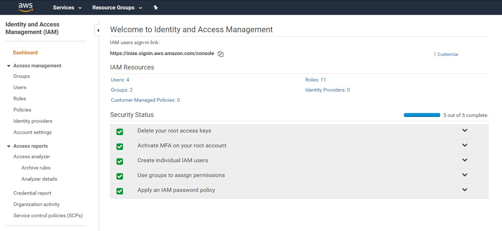
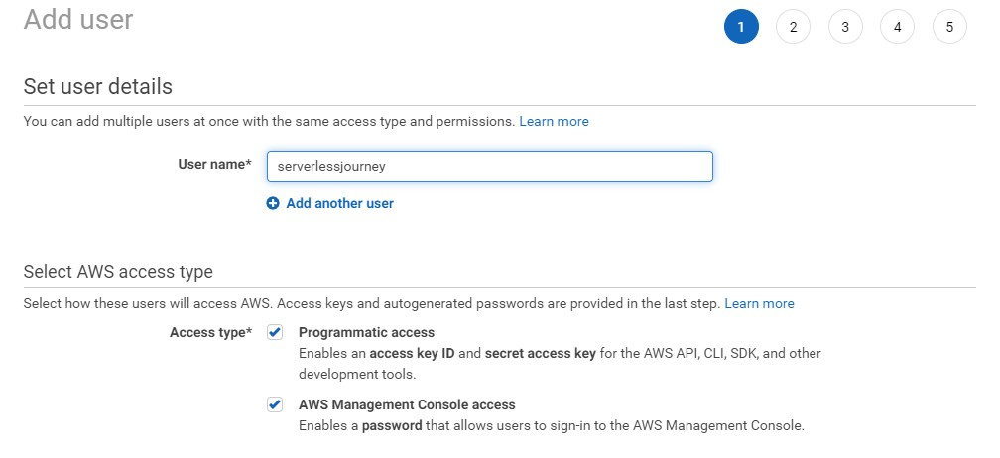
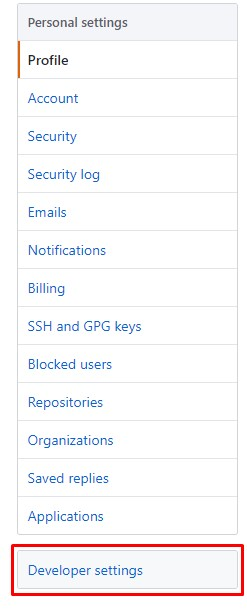
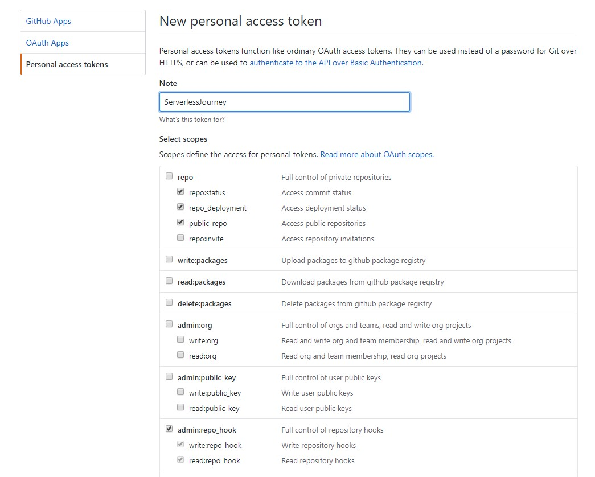

# The Github+AWS CI/CD Tutorial

## Introduction: A lot of questions

I've been working with AWS and Github for a while, one day one of my teammates that's been working on mostly on legacy code came across and asked me a very simple question.
*Good news!, Management has just asked me to create a new project but applying all that new CI/CD thing in AWS. So how do I do it?*, *What do I need?* and most important *What if I want to do some Proof of Concept with my own resources first, what's starting point?*

I gave him and his fellow teammates a little crash course, and after that I was left wondering. Did I taught everything?, I tried to cover all the steps
my mentor taught me but... were those the right steps? I mean that method was or is meant for the company I work for, but as a simple human being, is that what I need? Is there a way of simplifying the whole thing? Well... that's the very exact reason I'm writing this down.

## What we will learn

We will create a very simple project. Trust me. __SIMPLE__. A web application that runs entirely and free in AWS, a fully serverless web app.
OK did I said __SIMPLE__? Yes I did, but turns out that many of this tutorials or articles are based in programming languages like __node.js__, __python__, or even __go__, it's a bit odd to find them based on __.net__ technology, yeah I know that won't be so simple, but like I said before,
trust me, we won't dig a lot on __.net__.
One more thing that needs to be addressed is we are going to do this all by avoiding the AWS Web console. __Mostly it's all going to be command line
based__, sorry no screen shots.

And, what if I have never had an AWS nor github account? I will take you down through all the steps, no prior AWS nor github knowledge is required.

## What we are going to build

We will end up with the following deliverables or artifacts.

- A personal github account that's gonna be hosting the repository for the web app.
- A personal AWS account that's going to serve and host our web app.
- A couple of build pipelines that automate the process of building, testing and deploying the web app.
- Policies and Roles that will allow us to grow, and will let collaborators to do some stuff.
- A database hosted in AWS
- A web Application hosted in AWS
- A couple of Lambdas that will serve our web app and why not a couple of inner account tasks
- We're gonna end up with three different environments develop,stage and production.

## All paths lead to Rome

Even though we know we want and also placed a couple of constraints, there are many ways to achieve our goal, so I'm going to teach you two approaches and let you think about both of them and then choose the one you like the most.

There is the [Serverless Framework Way](https://www.serverless.com) and the [Cloudformation](https://docs.aws.amazon.com/AWSCloudFormation/latest/UserGuide/Welcome.html) Way. Both are good approaches and I'll try to cover both of them.

Other prerequisites are:

- [Visual Studio Code](https://code.visualstudio.com/)
- [Python](https://www.python.org/)
- [PIP](https://pip.pypa.io/)
- [Node.js](https://nodejs.org/)
- [AWS CLI Tools](https://aws.amazon.com/cli/)
- [Serverless Framework](https://serverless.com/)
- [dotnet core SDK](https://dotnet.microsoft.com/download/dotnet-core/2.1)

## Let the fun begin

### AWS Setup

Well start with the very basics but not all the basics. What I mean is that we'll start up from scratch so what we'll need is a brand new AWS account and a brand new Github Account. I'm not going to cover the steps involved in neither of both. These are the most important assets in the tutorial.

So once you got your AWS account you will have to login to the console type in the searchbox IAM.
Once in IAM you'll cover all the steps required for a secure account.
At the end you'll end up with something like this.



For the create __Individual IAM Users__ create an administrator user with both access types. Console and Programmatic Access, the rest of the process is the default, just hit next until you're done.



Copy your access key and secret.

Now in a open up a terminal and type the following:

```
aws config
```

The command will ask for your access key and secret you just created. __This is the only time you'll need them.__
It will ask you for your preferred region. In my case it was __us-east-1__.

### Github setup

For Github it's the same thing you'll have to create a Repository and __Personal Access Token__
The repository creation is pretty straight forward, and the __Personal Access Token__ can be created by accessing your account settings
and selecting the __Developer Settings__ section.



Then you'll be able to create a __Personal Access Token__ with the following permissions.



Once again copy and paste the newly created token into a notepad(don't save it)

## We're all set

By this point in time you'll have to choose between Cloudformation and Serverless to continue on.

* [Cloudformation Journey](doc/cf.md)